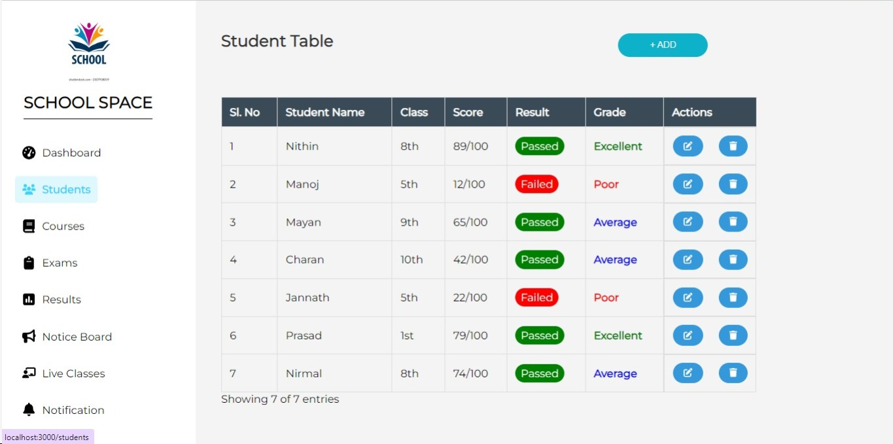
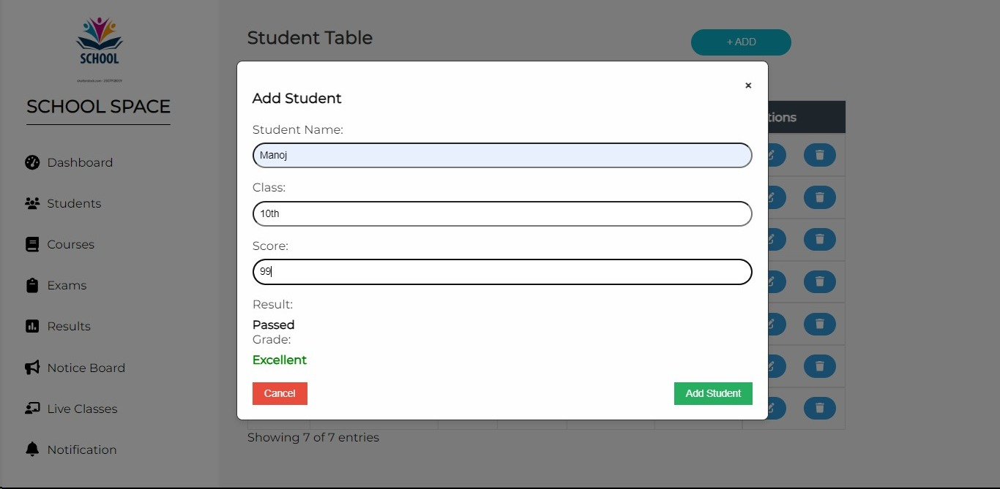
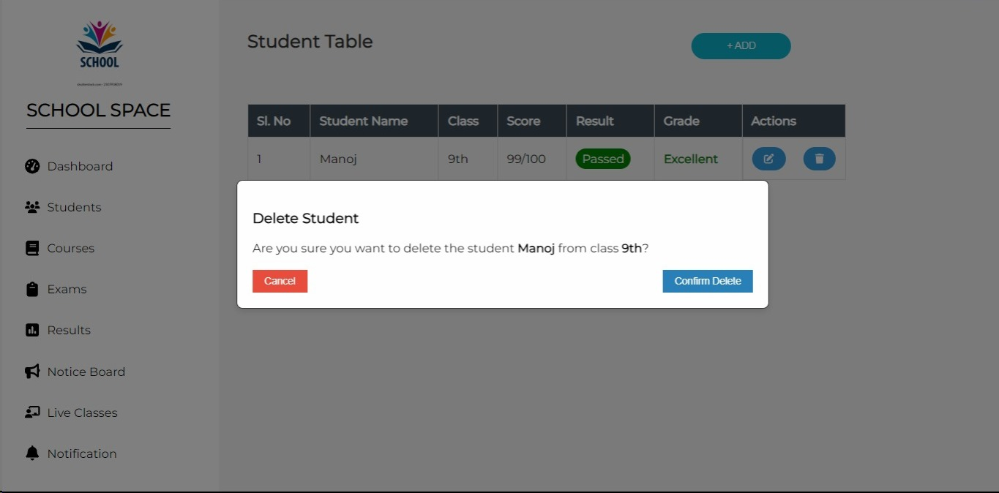
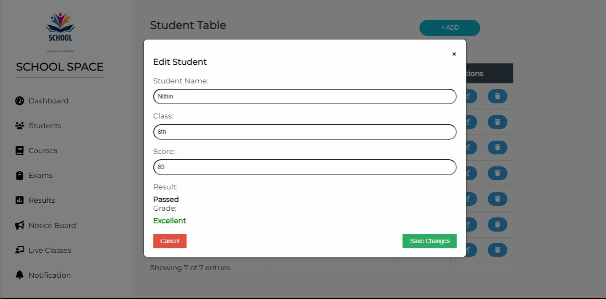
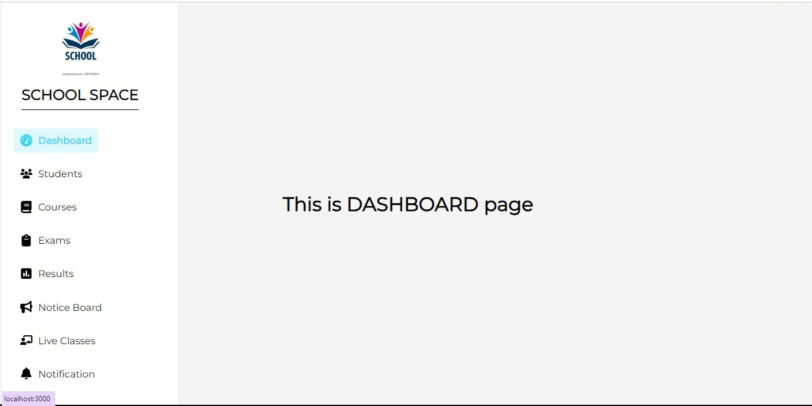

# Student Table Management System

A simple React application for managing student information, including their names, classes, scores, results, and grades.

## Table of Contents
- [Introduction](#introduction)
- [Features](#features)
- [Installation](#installation)
- [Usage](#usage)
- [Screenshots](#screenshots)

## Introduction

The Student Table Management System is a web application built using React that allows users to add, edit, and delete student information. The application dynamically calculates the result and grade based on the entered score.

## Features

- Add new students with their details.
- Edit existing student information.
- Delete students from the table.
- Automatic calculation of result and grade based on the entered score.
- Responsive design for a better user experience.

## Installation

1. Clone the repository to your local machine:

    ```bash
    git clone https://github.com/Manoj-p2304/Assignment-1.git
    ```

2. Navigate to the project directory:

    ```bash
    cd Assignment-1
    ```

3. Install dependencies:

    ```bash
    npm install
    ```

## Usage

1. Start the development server:

    ```bash
    npm start
    ```

2. Open your browser and navigate to [http://localhost:3000](http://localhost:3000).

3. Use the application to manage student information.

## Screenshots


*Student Table with dynamic result and grade calculation*



*Modal for adding or editing student information*



*Modal for deleting student from table*



*Modal for editing student details*



*other Routes*


